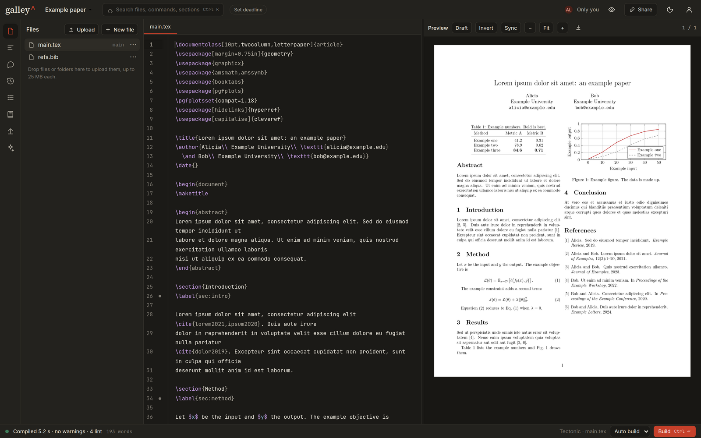
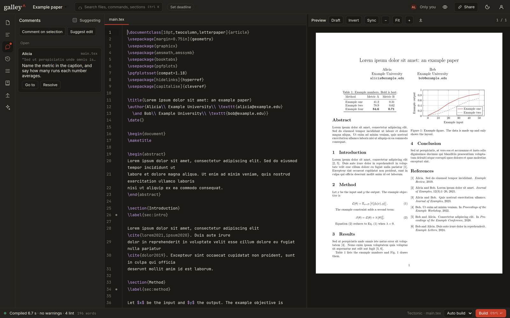
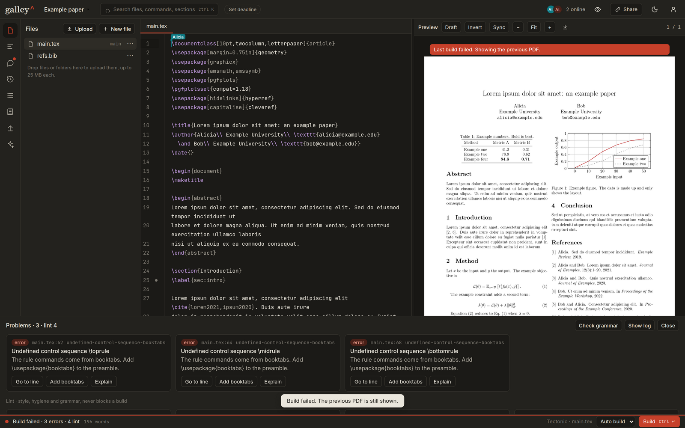
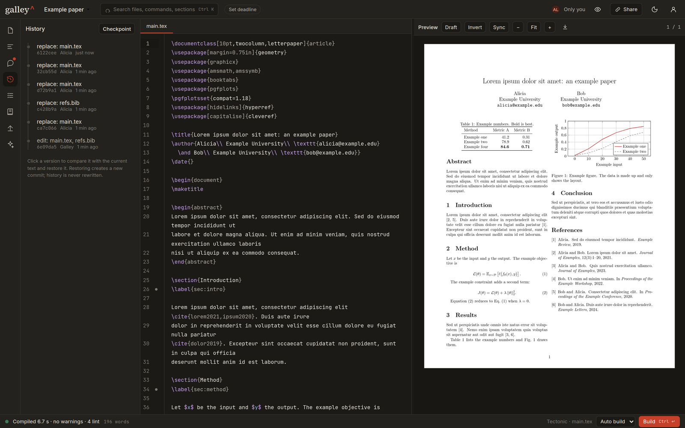
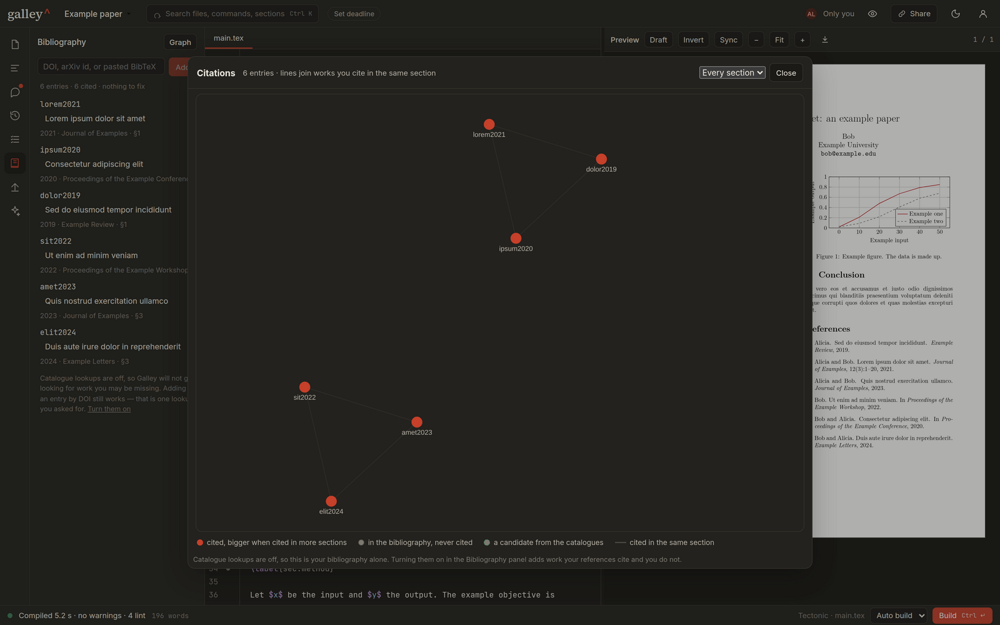
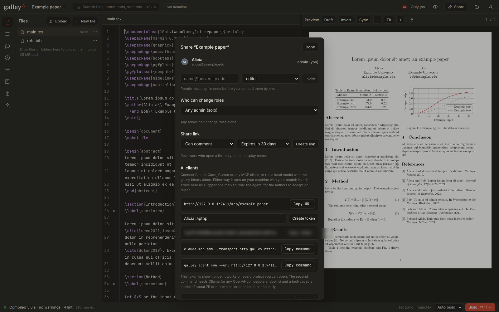
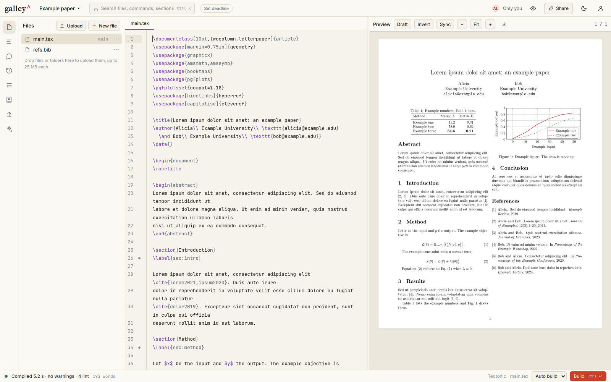
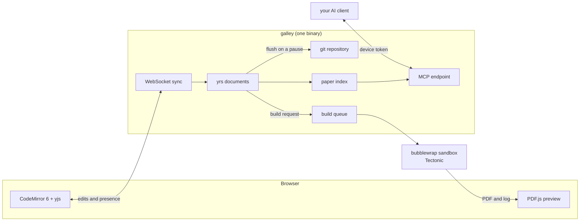

<div align="center">

# Galley

**Write together. Compile anywhere.**

A self-hosted, single-binary collaborative LaTeX editor. Live editing, sandboxed builds, git-backed
history, and a project-scoped MCP server for the AI client you already use.

[](https://github.com/Minerva-Laboratories/Galley/actions/workflows/ci.yml)


</div>



Galley runs on one machine you control. It is a single binary with the web app embedded, a SQLite
database, and one git repository per project. There is no queue, no cache server, no separate
database, and no Node runtime in production. You install it, you run it, and your documents stay on
your disk.

## Contents

- [Why Galley](#why-galley)
- [Install](#install)
- [What it does](#what-it-does)
- [How it works](#how-it-works)
- [Command line](#command-line)
- [Configuration](#configuration)
- [Run it for a group](#run-it-for-a-group)
- [Develop](#develop)
- [Documentation](#documentation)
- [Status](#status)
- [Security](#security)

## Why Galley

Six rules decide every design question in this project, in this order.

1. Saving never depends on anything. Not on a compile, not on the network, not on another user.
2. The infrastructure is boring. One binary, one data directory, SQLite, and git.
3. The project directory is the boundary. Compiles and agents see nothing outside it.
4. Every automated edit is a diff that a human accepts. Agents never write files.
5. Errors are explained, not dumped. Each one is a card with a hint and often a one-click fix.
6. Limits are announced before they bite, and they never destroy work.

## Install

Build the binary, then run the installer. Both paths are idempotent, so you can re-run either one to
upgrade.

```sh
cargo build --release       # builds the web app and embeds it in target/release/galley

sudo deploy/install.sh      # system-wide: /usr/local/bin, a galley user, a systemd service
deploy/install.sh           # or for your user only: ~/.local/bin, no service
```

The installer creates the data directory, writes a configuration file, fetches the build engine, and
finishes by running `galley doctor`, which reports what is in place and what is missing.

```sh
galley serve                # http://127.0.0.1:7000
```

The first screen asks you to create an admin account. The first build downloads Tectonic, about
9 MB, into the data directory. Later builds work offline.

## What it does

### Edit together, and keep editing when the network drops

Two people, two cursors, one document. Text syncs through a CRDT, so there are no merge dialogs and
no lost keystrokes. Edits are stored locally first, which means you keep typing while offline and the
document catches up when you reconnect. Comments and suggestions anchor to the text itself, so they
survive the edits around them.



### Builds you can read

Galley compiles with Tectonic inside a bubblewrap sandbox. The log parser turns the output into
cards: what went wrong, where, and what to do about it. Many cards carry a fix you can apply with one
click. A failed build never replaces the PDF you already had.



### History without a git lesson

Every pause in typing becomes a commit. The History drawer shows the timeline, diffs any two points,
and restores an old version as a new commit. History is never rewritten. Checkpoints are tags, and
`latexdiff` renders a marked-up PDF against a checkpoint for a camera-ready comparison.



### A bibliography that checks itself

The bibliography manager adds entries from a DOI or an arXiv identifier, finds duplicates, fills in
missing fields, and flags preprints that now have a published version. The citation graph draws your
bibliography as it is used: two works are joined when you cite them in the same section, so clusters
match how the paper argues.



### Retrieval that costs no model

LaTeX names its own structure, so retrieval can use it. Galley parses sections, labels, references,
citations, captions and equations into a paper map, ranks it around what you are working on, and
answers with the smallest useful thing first. There are no embeddings and no reranking model
anywhere in the loop.

| Tool | Question it answers |
|---|---|
| `map` | What is in this paper, and what is connected to what |
| `context` | Which passages match this query, one line each |
| `bib` | What is missing, duplicated, uncited or incomplete |
| `math` | Where else does an expression of this shape appear |
| `literature` | What do the open catalogues know about these references |

### Bring your own AI client

Each project exposes an MCP server over HTTP with a closed tool set. Point Claude Code, an SDK client
or any MCP client at it with a device token you can revoke. The only write path is `propose_patch`,
which produces a suggestion for a human to accept or reject. Nothing runs on the server.

```sh
claude mcp add --transport http galley https://your-host/mcp/<project> \
  --header "Authorization: Bearer <device-token>"
```



### Start from a template

Six templates ship inside the binary: blank article, conference paper, preprint, talk, thesis or
report, and response to reviewers. No venue class files are bundled, because those belong to the
venue. Each paper template names the class to swap in.

### More that is already built

- Snippets with automatic labels, label renaming across files, and a lint pass for stale labels,
  uncited entries, doubled words and breakable references.
- Word budgets per section, a deadline pill, and a task list built from `TODO` comments.
- Venue presets, a compliance meter, and a submission packer that verifies the archive in a clean
  sandbox before you upload it.
- A persistent figure cache, so TikZ figures are drawn once and reused until their code changes.
- SVG figures converted without shell escape.
- Two-way SyncTeX. Click the PDF to reach the source, click the source to reach the page.
- A light theme and a dark theme, both checked for contrast.



## How it works



Saving is the CRDT write. It never waits for a build, a lint or a network call. The flusher turns
quiet periods into commits, so the git history reads like a person wrote it. Builds run in a sandbox
with no network and only the project directory mounted. The paper index is parsed from the live
documents, so it is never stale.

| Crate | What it holds |
|---|---|
| `galley-server` | axum app, routes, auth, WebSockets, the embedded web app |
| `galley-sync` | yrs documents, persistence, the flusher that writes to git |
| `galley-history` | git operations, checkpoints, diffs, latexdiff, remotes |
| `galley-build` | sandbox, engines, queue, log parser, hints, profiler, figure cache |
| `galley-index` | paper map, passage search, bibliography audit, citation graph, math search |
| `galley-lit` | Crossref and OpenAlex lookups, cached, opt-in per project |
| `galley-agents` | the local agent runner and its tools |
| `galley-cli` | the `galley` command, installer helpers, doctor, backup |

## Command line

```sh
galley serve [--port 7000] [--dev]        # run the server
galley doctor                             # check sandbox, engine, disk, ports, TLS, fonts
galley init                               # write a default galley.toml
galley engine install                     # fetch Tectonic now instead of on the first build

galley admin create-user <email> --name "Name" --password '...' [--admin]
galley admin reset-password <email>
galley project new <name> --owner <email>

galley map                                # the paper map, in the terminal
galley find <query>                       # ranked passages
galley bib                                # bibliography audit
galley math '<expression>'                # find formulas by shape
galley lit                                # catalogue lookups for the bibliography
galley agent run <project> --agent fix-build
```

## Configuration

`galley.toml` lives in the data directory, or wherever `--config` points. Every key is optional.

```toml
[server]
bind = "127.0.0.1:7000"
domain = ""              # set it to serve publicly; certificates come from Let's Encrypt
public_signup = false

[build]
engine = "tectonic"
sandbox = "auto"         # bubblewrap, then docker, then refuse in public mode
timeout_s = 120
memory_mb = 2048

[grammar]
languagetool = "off"     # off, auto, or the URL of a LanguageTool server
```

Public mode refuses to start without a sandbox. An unsandboxed LaTeX compiler must not face the
internet.

## Run it for a group

One host runs everything. Set `server.domain` in `galley.toml` and Galley obtains
its own certificate, or leave it empty and put Galley behind a reverse proxy you
already run. Either way the machine needs bubblewrap or Docker, because public
mode refuses to start without a compile sandbox. `deploy/README.md` covers the
service, the sandbox, TLS and backups.

## Develop

```sh
cargo run -p galley-cli -- serve --dev --data-dir /tmp/galley-dev   # API on port 7000
cd web && npm install && npm run dev                                # Vite on port 5173
```

Run all four checks before you claim something works.

```sh
cargo test --workspace
cargo clippy --workspace --all-targets -- -D warnings
cd web && npm test
cd web && npm run lint
```

`mockup/galley-prototype.html` is the interaction reference for the web app. Open it in a browser and
try `fig` followed by Tab, then Ctrl+K, then Ctrl+Enter.

## Documentation

| File | Contents |
|---|---|
| `docs/SPEC.md` | The product and engineering specification. Authoritative for behaviour. |
| `docs/RETRIEVAL.md` | The paper index: map, passages, bibliography, graph, math search. |
| `deploy/README.md` | Running Galley as a service, the sandbox, TLS, and backups. |

## Status

Milestones M1 to M6 and M8 are built and tested. The 1.0 release is next.

| Milestone | Scope | State |
|---|---|---|
| M1 Skeleton | Sync between tabs, text in git | Built |
| M2 Build | Tectonic in a sandbox, error cards, SyncTeX, profiler | Built |
| M3 Collaboration | Roles, share links, comments, suggestions, presence, offline | Built |
| M4 History | Checkpoints, scrubber, diffs, restore, latexdiff, remotes | Built |
| M5 Agents | MCP server per project, built-in agents, device tokens, local runner | Built |
| M6 Quality of life | Snippets, lint, tasks, deadlines, packer, figure cache | Built |
| M7 Cloud | Accounts and project states | Planned |
| M8 Polish | Bibliography manager, LanguageTool, templates, installer, doctor | Built |

## Security

- Compiles and agents run in a sandbox with no network and only the project directory mounted.
- Agent network access goes through a host proxy with an allowlist. Everything else is refused and
  logged.
- Passwords use Argon2id. Sessions are HttpOnly cookies with a CSRF token on every write.
- Share tokens and device tokens are 32 random bytes, role-scoped and revocable.
- Document text, tokens and keys are never written to the log.

Report a vulnerability privately to the repository owner. Please do not open a public issue for it.

## License

[PolyForm Shield 1.0.0](LICENSE.md).

In plain words: use it, change it, redistribute it, and run it for yourself,
your group, your university or your company, at no cost and with no time limit.
The one thing you may not do is use Galley to provide a product or service that
competes with Galley. There is no automatic conversion date. If that ever
changes, it changes because we decide to release a version under different
terms.

Copyright 2026 Minerva Laboratories.
